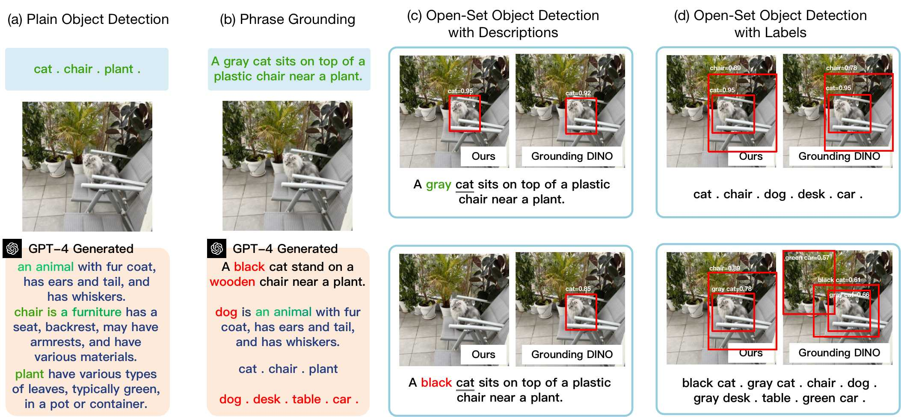

# DoRA

  

Figure 1: Overview of Pre-Training the proposed DoRA with Attributes. (a) Learning to understand the semantic class from the generated attribute-based definitions (correspond to Algorithm 1). (b) Learning to distinguish instance objects via attribute-based prompts (correspond to Algorithm 2). (c-d) Comparison of the detection results on hard negative descriptions and attribute-based labels.
